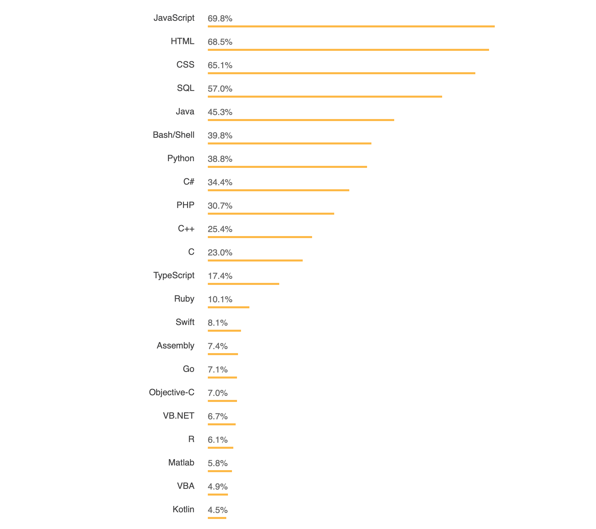
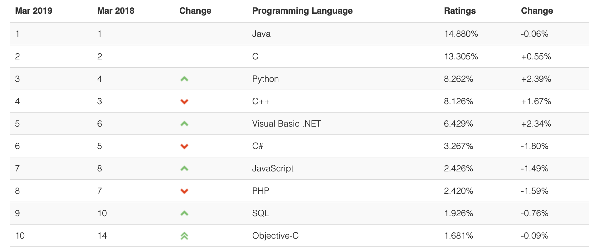

Is C++ a dead language?
=======================

In my university degree, there came a point where I had a choice of enrolling in either a Web Applications class or an Advanced C++ class. My impression of C++ was that is was C with some extra bits, and it was old and going out of fashion. This of course is not the case in any sense, but it is easy enough to get this impression.

Perception
----------
The computer industry as a whole is expanding, and so are web apps and technologies. With the field expanding so much and with demand rising, a new wave of people are getting involved. There is now room for jobs that can be done with less training; C++ is probably not the best language to skill up quickly in and jump into the workforce, especially considering so much of the workforce is centred around web. Because of this, a large segment of the industry are using languages like Java, Python and Javascript. Relative to this new influx, C++ would seem to be outdated and shrinking, but in absolute terms, C++ usage is growing at a great pace.

Modern Use
----------
C++ is a systems level programming language, capable of getting close to the metal, yet with modern (post C++11) standards, can still be programmed with high level paradigms (its main advantage over C). It is the go to programming language for high performance computing such as in implementing graphics, machine learning, implementing browsers and even implementing other languages.

C and C++ underlies nearly all modern software and programming languages today. Many scripting languages Python, Ruby and Perl are at least partially implemented in, and call C and C++ libraries under the hood. The 3 major desktop operating systems are mostly written in different proportions of C, C++, C# and Objective-C, as well as some Assembly. C++ is also used in Android and iOS operating systems. C and C++ also dominate embedded scene, the magnitude of which should not be underestimated. This includes microprocessors and chips embedded into many devices in cars, trains, aircraft, robotics, industrial/manufacturing control systems, network infrastructure and more. I think it is safe to say that a majority of all computing platforms can run C++.

Statistics
----------
### Stack Overflow Developer Survey 2018

C++ comes in at number 10 on the Stack Overflow Developer Survey ahead of C. Before it comes a lot of web languages (JavaScript, HTML, CSS, SQL, PHP), and some languages found in enterprise backend (C# and Java). C++ notably comes out ahead of such languages as Swift, Ruby, Go and Kotlin.

### TIOBE Index

The TIOBE Index puts C++ at number 4, having recently been overtaken by Python, which SO and TIOBE both show has grown in recent years. In this ranking there appears to be less of a weighting towards web tech. You can see how the index is calculated [here](https://www.tiobe.com/tiobe-index/programming-languages-definition/)

Alternatives
------------
Newer programming languages have appeared on the scene in the same or similar categories as C++. Rust is the most recent, coming in at number one on the Stack Overflow Developer Survey's "Most Loved" languages. I like to think of Rust as what C++ would be if it was designed today without the need to support previous standards, and with the benefit of hindsight taking language design cues from Haskell and and others. Some of the ideas from Rust have filtered back into the most recent standards of C++. Efforts have been made to make Rust accessible to people who want to learn it, but it is not as simple to learn as Python. It's almost easier to learn Rust after learning C++ and Haskel, because it is possible to see why certain decisions are made in the language. Other performant alternatives include D, Nim and Go.

Java compiles to virtual machine byte code for the sake of portability. The Clang LLVM does a similar thing. C++ has Value semantics, RAII, whereas Java uses reference types, garbage collection (automatic memory management). Java has its own place, but where every bit of performance matters (often not the case), C++ is the more suitable choice.

Some of the drawbacks to C++ include the comparatively steeper learning curve, the ability and freedom to create bugs when manually managing memory, and its outdated library import system (which has started to be addressed in the upcoming C++20 standard).

Conclusion
----------
There will always be a need for C++, it is so engrained in computing, it is growing in use and it is evolving to adapt to modern programming paradigms. Though its heritage and perception can make it seem old and outdated, it remains popular and dominant among alternatives for system level high performance programming.

References
----------
https://insights.stackoverflow.com/survey/2018/#most-loved-dreaded-and-wanted  
https://www.tiobe.com/tiobe-index/  
https://www.quora.com/Is-C-dying-2  

